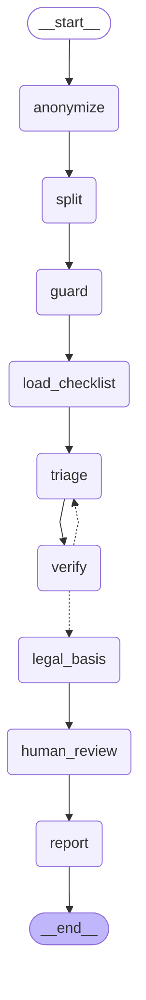
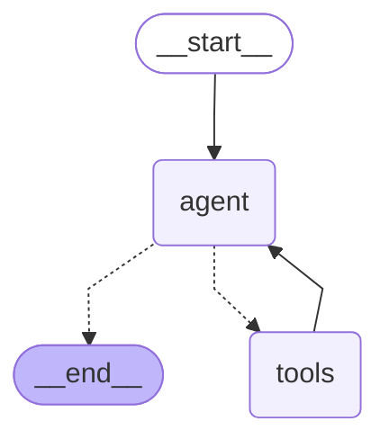

```mermaid
---
config:
  flowchart:
    curve: linear
---
graph TD;
	__start__([<p>__start__</p>]):::first
	anonymize(anonymize)
	split(split)
	guard(guard)
	load_checklist(load_checklist)
	triage(triage)
	verify(verify)
	legal_basis(legal_basis)
	human_review(human_review)
	report(report)
	__end__([<p>__end__</p>]):::last
	__start__ --> anonymize;
	anonymize --> split;
	guard --> load_checklist;
	human_review --> report;
	legal_basis --> human_review;
	load_checklist --> triage;
	split --> guard;
	triage --> verify;
	verify -.-> legal_basis;
	verify -.-> triage;
	report --> __end__;
	classDef default fill:#f2f0ff,line-height:1.2
	classDef first fill-opacity:0
	classDef last fill:#bfb6fc

```

Агент-юрист (подграф узла legal_basis):

```mermaid
---
config:
  flowchart:
    curve: linear
---
graph TD;
	__start__([<p>__start__</p>]):::first
	agent(agent)
	tools(tools)
	__end__([<p>__end__</p>]):::last
	__start__ --> agent;
	agent -.-> __end__;
	agent -.-> tools;
	tools --> agent;
	classDef default fill:#f2f0ff,line-height:1.2
	classDef first fill-opacity:0
	classDef last fill:#bfb6fc

```
